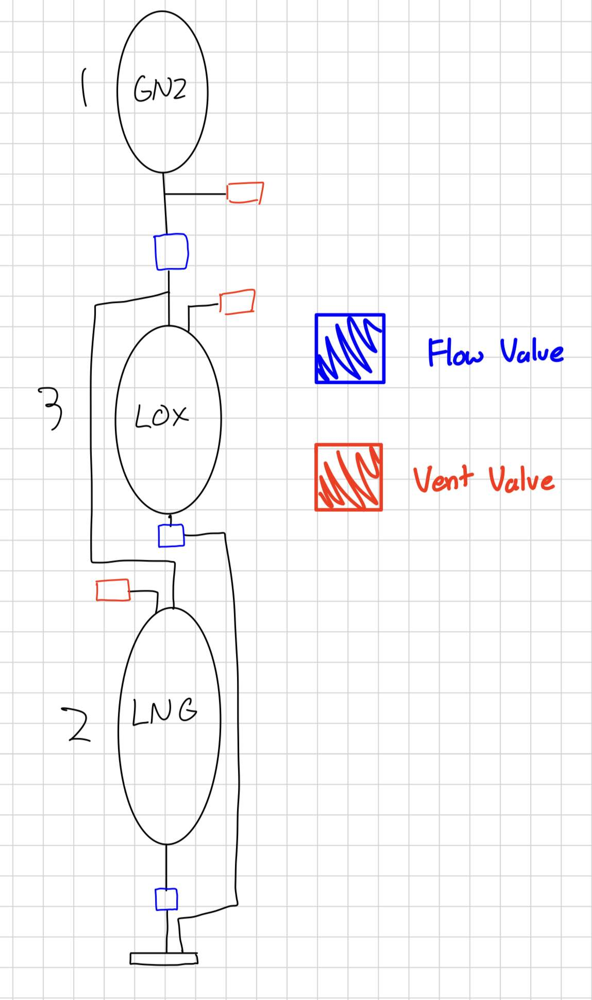

# phoenix-gs
Phoenix ground station with Arduino \
Works with the launch box to send valve control signals with protected logic

# Launch Control Loop Logic
* One of the following mode will be ran during each void loop() call

## Launch Mode (Risk: Low)
Launch sequence has four stages \
Each stage is coded by a six digit binary representation \
Each two digits representation:
* 00: flow valve close, vent valve close
* 10: flow valve open, vent valve close
* 10: flow valve close, vent valve open
* 11: forbiden state, cannot open flow and vent at the same time

From left to right, each two digits represents the state for: \
(arm | fuel valve 1 | fuel valve2 ) \
Each state has two valves: flow valve and vent valve

### PRE-ARM (00|00|00)
* default state, nothing happens
* all valves closed

### ARMED (10|00|00)
* arm flow valve open

### ABORT (01|01|01)
* open vent valves for all 
* emergency break, abort the mission

### LAUNCH:(10|10|10)
* after arm flow valve is opend
* open the flow valevs for both fuels
* rocket launching, no way back

### Buttons/Swithces
* Abort (button): has highest priority, open vent valves for all
* Arm (switch): open/close arm flow valve
* Launch (button): open fuel 1&2 flow valves

## Launch Control - Fueling Mode (Risk: Medium)
* In fueling mode, all flow valves are locked in OFF mode
* all vent valves can be controlled by individual switch

## Launch Control - Dev Mode (Risk: High)
* This mode is intended for testing valve openings before fueling
* All valves are free to be switched on and off
* Be very sure of what you are doing when using this mode

## Fuel and valve diagram

## Draw.io Link
* https://drive.google.com/file/d/1tbEu6RL3mTaqcmE_wz8DDxYVTB-fJ5dZ/view?usp=sharing

# Launch Terminal Physical Specifications
## Ethernet
[W5500 Ethernet LAN Network Module](https://www.amazon.com/HiLetgo-Ethernet-Network-Support-Microcontroller/dp/B0CDWX9VQ5)

# Resource
* https://github.com/njh/W5500MacRaw