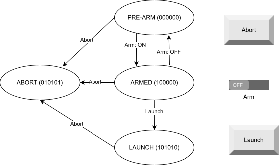
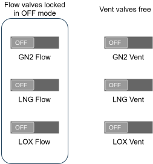
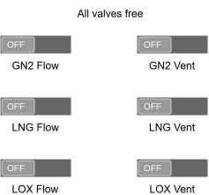

# phoenix-gs
Phoenix ground station with Arduino \
Works with the launch box to send valve control signals with protected logic

## Latest fix after static fire on Febrary 15, 2026
* A switch latch bug was discovered during the static fire
* Trigger condition: Launch Mode -> ARM Switch ON-> Launch Button -> DEV Mode -> ARM Swtich OFF -> Launch Button
* When performing a launch (usually cold flow before static fire), and close the ARM switch outside of the launch mode, there will be a very brief moment that the ground station will sent ARM ON state to the flight computer when entering the launch mode again. This is due to the debounce switch reading mechanism.
* This branch has been archieved in ``static-fire-Feb2026-record``
* The current main branch has patched this fix to enforce a 2 second sensor read stabalization time when swtiching state, as well as a state check when entering the launch mode. Any invalid state will prevent entering the launch mode and revert back to the previous state.

## Ground station finite state machine
* One of the following mode will be ran during each void loop() call
* Dev Mode: all valves can be individually controlled
* Fuel Mode: only the vent valves (LGN-V, LOX-V, GN2-V) can be opened; all flow and pressure valves are forced to close (LNG-F, LOX-f, LNG-P, LOX-P all closed)
* Launch Mode: ARM and then launch; Emergency Stop can be triggered anytime to open all vent valevs to release pressure

## Binary encoding of the buttons/switches

### Launch sequence encoding
PRE_ARM = 0b0000000; // Safe: all valves closed \
ABORT &nbsp;&nbsp;&nbsp;&nbsp;= 0b0010101;   // Abort: open all vent valves \
ARMED &nbsp;&nbsp;&nbsp;= 0b1100000;   // Armed: ready to launch, waiting trigger \
LAUNCH &nbsp;= 0b1101010;  // Launch: ignition/flight started 

### Individual valve masks
lng_pressure_mask = 0b1000000; \
lox_pressure_mask = 0b0100000; \
gn2_vent_mask = 0b0010000; \
lng_flow_mask = 0b0001000; \
lng_vent_mask = 0b0000100; \
lox_flow_mask = 0b0000010; \
lox_vent_mask = 0b0000001;

null_mask = 0b0000000;

## Launch Mode (Risk: Low)
Launch sequence has four stages

### PRE-ARM (0000000)
* default state, nothing happens
* all valves closed

### ARMED (1100000)
* lng_pressure open
* lox_pressure open

### ABORT (0010101)
* open vent valves for all 
* emergency break, abort the mission
* gn2_vent open
* lng_vent open
* lox_vent open

### LAUNCH:(1101010)
* after arm flow valve is opend
* open the flow valevs for both fuels
* lng_pressure open
* lox_pressure open
* lng_flow open
* lox_flow open
* rocket launching, no way back

### Buttons/Swithces
* Abort (button): has highest priority, open vent valves for all
* Arm (switch): open/close arm flow valve
* Launch (button): open fuel 1&2 flow valves
* **NOTE**: The diagram is not up to date (only 6 digits) because we added a new switch. But the flow logic is correct.

## Launch Control - Fueling Mode (Risk: Medium)
* In fueling mode, all flow valves are locked in OFF mode
* all vent valves can be controlled by individual switch
* **NOTE**: GN2 Flow is now split into: LNG Pressure and LOX Pressure

## Launch Control - Dev Mode (Risk: High)
* This mode is intended for testing valve openings before fueling
* All valves are free to be switched on and off
* Be very sure of what you are doing when using this mode
* **NOTE**: GN2 Flow is now split into: LNG Pressure and LOX Pressure

## Draw.io Link
* https://drive.google.com/file/d/1tbEu6RL3mTaqcmE_wz8DDxYVTB-fJ5dZ/view?usp=sharing

# Launch Terminal Physical Specifications
## Ethernet
* [W5500 Ethernet LAN Network Module](https://www.amazon.com/HiLetgo-Ethernet-Network-Support-Microcontroller/dp/B0CDWX9VQ5)

# Resource
* https://github.com/njh/W5500MacRaw